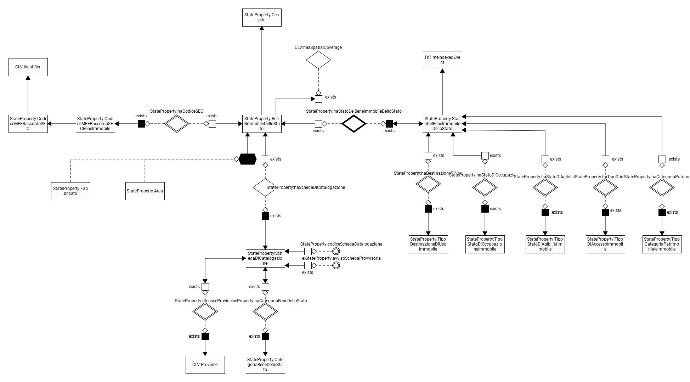

# Ontologie

Le ontologie descrivono il patrimonio informativo dell'ente relativamente
al proprio dominio di competenza.

Per le ontologie si utilizzano directory versionate.

Le ontologie sono pubblicate in formato RDF/Turtle (media type text/turtle)
e l'estensione del file è `.ttl`.

Opzionalmente possono essere forniti anche formati OWL (`.owl`) e Notation3 (`.graphol`).

## Struttura Directory

Ogni ontologia deve seguire questa struttura:

```
nome-ontologia/
├── latest/
│   ├── nome-ontologia.ttl     # Sorgente principale (OBBLIGATORIO)
│   ├── nome-ontologia.owl     # Opzionale
│   └── nome-ontologia.graphol      # Opzionale
└── v{version}/
    ├── nome-ontologia.ttl
    ├── nome-ontologia.owl
    └── nome-ontologia.graphol
```

## Convenzioni

- Il file `.ttl` è il formato primario e obbligatorio
- Usare URI stabili per le risorse
- Includere metadati: `dct:title`, `dct:description`, `owl:versionInfo`
- Documentare classi e proprietà con `rdfs:label` e `rdfs:comment`

## Standard Utilizzati

- **RDF/Turtle**: https://www.w3.org/TR/turtle/
- **OWL 2**: https://www.w3.org/TR/owl2-overview/
- **Dublin Core**: http://purl.org/dc/terms/

## Diagramma Ontologia StateProperty


